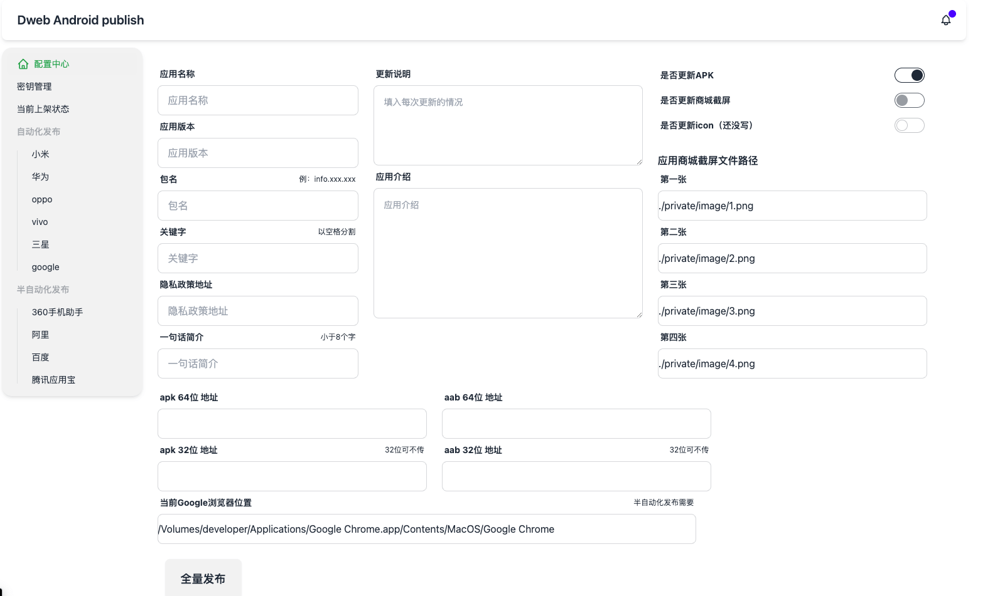
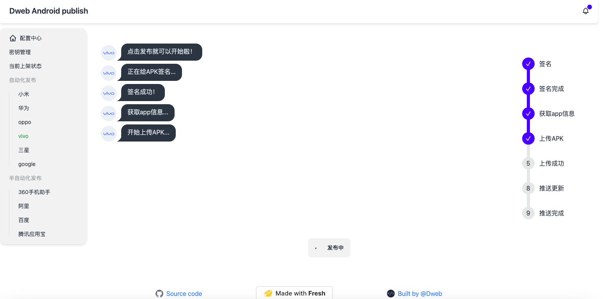

# android-auto-distribute

android 自动化更新脚本。支持：`华为`，`小米`，`oppo`,`vivo`,`三星`,`Google Play`。

> 魅族 不让上架浏览器，抽象。

半自动化发布平台有： [阿里开发者](https://open.9game.cn/)，[360 手机助手](https://dev.360.cn/),[百度开发者](http://app.baidu.com),[腾讯应用宝](https://app.open.qq.com/p/home)。都是这些不是手机厂商的没有。

半自动化发布需要用户输入手机验证码登陆，运行脚本的时候会打开浏览器。因此需要在配置中心配置 Google 浏览器地址

## 启动可视化界面发布 🍟

```bash
deno task start
```

<div style="display: flex; justify-content: space-between; align-items: center;">
  
  
</div>

## 各个平台证书相关

各个平台接口加密方式各不相同，需要下载各个商场的证书(或公钥/私钥)放到项目根目录的 `private`文件夹内。
结构大致如下：

```bash
.
├── README.md
├── private
│   ├── samsung
│   │   └── privateKey.txt
│   ├── xiaomi
│   │   └── dev.api.public.cer
│   ├── google
│   │   └── privateKey.json
```

> 当然您也可以放到任何位置，只需要修改 `env.ts` 里的对应参数。

### samsung key

[samsung key 获取地址](https://developer.samsung.com/galaxy-store/galaxy-store-developer-api/create-an-access-token.html)，接着按照文档一步一步进行生成。

### [google 服务账号密钥](https://developers.google.com/android-publisher/getting_started?hl=zh-cn#oauth)

获取需要先创建对应的权限账号，然后再进行密钥导出，重命名为 `privateKey.json` 放到对应文件夹。


### 半自动化发布

没有自动发布接口的平台需要用户输入手机验证码登陆。这时候会打开浏览器，并且帮助用户输入所有需要发布更新的信息。

> 在半自动化发布的时候，会让用户审核填充无问题后，手动点击提交审核，这个还是得人工看一遍比较有底。

## query（还没写）

查询平台 app 的上架情况。

```bash
deno task info [xiaomi]
```

## 维护需求

特别是半自动化发布脚本，厂商可能更新一下就得改，遇到问题可以提 issue，或者直接 pr。
